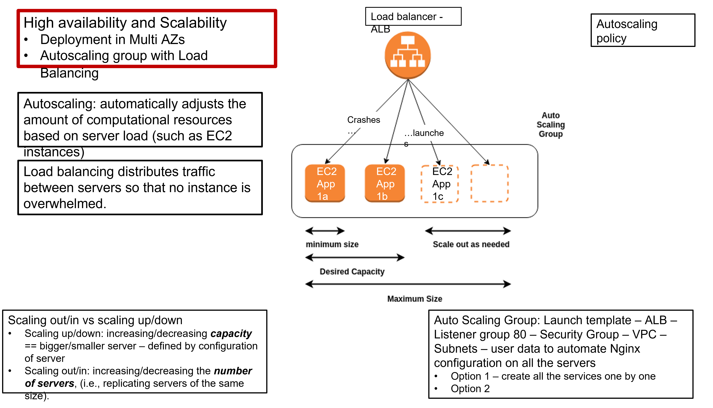

# AWS Auto Scaling groups (AWS ASGs)

- AWS autoscaling manages the number of instances available to handle the load for your application.
- An ASG contains a collection of EC2 instances that are treated as a logical grouping for the purposes of automatic scaling and management.
- You specify the min, max and desired number of instances.
- Starts by launching enough instances to meet desired capacity.
- With specified scaling policies, the Auto Scaling launches and terminates instances as demand on an application increases or decreases.

## Elastic load balancing
- Automatically distributes incoming traffic across instances so that no instance is overwhelmed.
- Can attach diferent types for different requirements.

## Launch templates
- Specifies configuration information, such as instance type, AMI, key pair, security groups.
- Unlike a launch configuration, you create multiple versions of a template - for e.g., you can define a base configuration without an AMI, and then luanch a new version with an AMI and user data that has the latest version of an application for testing.
- Note as well that now all AWS Auto Scaling features are available for luanch configurations.

## Autoscaling policy options
- Target-tracking: select scaling metric and set target values, and then AWS adds or removes capacity to adjust the metric to be as close to the target value.
- Metrics include average CPU utilisation, average number of bytes recieved/sent out on network interfaces, or the average load balancer request count.
- Simple and step scaling policies use metrics and threshold values that are used to trigger the scaling policy.
- The difference with step scaling is that the adjustments vary based  on the size of the alarm breach.

## Benefits of ASGs

- Better fault tolerance. Amazon EC2 Auto Scaling can detect when an instance is unhealthy, terminate it, and launch an instance to replace it. You can also configure Amazon EC2 Auto Scaling to use multiple Availability Zones. If one Availability Zone becomes unavailable, Amazon EC2 Auto Scaling can launch instances in another one to compensate.

- Better availability. Amazon EC2 Auto Scaling helps ensure that your application always has the right amount of capacity to handle the current traffic demand.

- Better cost management. Amazon EC2 Auto Scaling can dynamically increase and decrease capacity as needed. Because you pay for the EC2 instances you use, you save money by launching instances when they are needed and terminating them when they aren't.

## Creating a launch template for autoscaling group

- Under Instances tab, select launch templates.
- Select Ubuntu 18.04 server from free tier.
- Although formatted differently, the details to be completed up to Advanced Details should be the same as for creating a new EC2 instance.
- Under advanced details, there is a section called User data. This is a provisioning file.
- At the top enter `#!/bin/bash`, then place provisioning details (for now just for update, upgrade and the installation/enabling of nginx in here).

## Monitoring
- Open the `AWS CloudWatch` console.
- Choose `Alarms`, then `create Alarm`.
- Select the metric you wish to use
- Fill in Name, Description, Threshold and Time values
- Choose `In-alarm` as the alarm state
- Either create a new topic (be sure to include email addresses) or select one you've used previously.
- Don't worry about the alarm action - you will this in a minute.
- Hit `Continue`, review and then `Create Alarm`.
- Navigate to the auto-scaling group- if you don't have a simple or step monitoring policy, create one.
- 
- At this point, add the alarm you created.
- If you already had a simple or step policy, you can edit this to add the alarm you just created.
- To test the monitoring system, enter an instance/instances and run an infinite loop, e.g.: `while :`
`do`
`echo "Running..."`
`done`
- For example, if you select the metric to be average CPUUtilisation, with a threshold of 50%, and you have a minimum of 2 instances, you will need to run a loop in both to ensure the metric breaches the threshold.