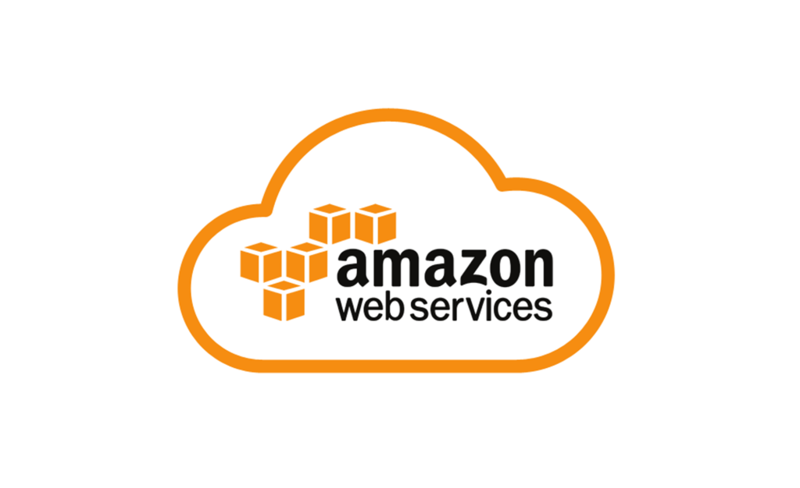

# Coud Computing AWS

## Why use cloud computing?
- Allows organisations to deliver services including servers, storage, databases, networking, software, analytics, and intelligence over the Internet.
- Increased flexibility.
- Theoretically always running.
- Cost-effective - "pay as you go" for services; use AWS for 2 hours, you pay for 2 hours. This allows you to scale up and scale down with varying demands.
- Amazon: AWS, Microsoft: Azure, Google: GCP, etc.
- Cloud computing services are responsible for ensuring the security of information in transit.
- Hybrid: Where confidential information is stored in a local data centre, and public information is deployed on cloud computing.
- Cloud computing allows you to deploy a product on a global scale in minutes.

## AWS
- Regions are the physical data centres for delivering AWS.
- A region contains at least two availability zones, as a general rule use the closest to your current location. For the academy, use London.
- The reason for having multiple availability zones is to protect against unexpected events - if an app is deployed in 2 availability zones if the first, primary one fails or is compromised the traffic for the app is redirected to the second while repairs are made.
- In principle can use multiple regions - but this leads to higher maintenance costs.
- GovCloud can only be used by government organisations.

## AWS Best Practices
- Naming conventions: group_yourname
- AWS EC2 instances should be turned off/stopped/terminated by 18:00 every day. With permission, you may use it until 20:00.
- Only use Ireland - eu-west-1/a/b/c
- AWS keys must NOT be shared with anyone, such as on public cloud or platforms, GitHub etc.

## Documentation
- [Creating and Using EC2 Instances](./documentation/creating_and_using_EC2_instances.md)
- [Creating and Using AMIs](./documentation/creating_and_using_AMIs.md)
- [Using S3](./documentation/setting_up_S3_bucket.md)
- [Auto Scaling](./documentation/AWS_autoscaling_group.md)
- [Amazon Virtual Private Cloud (VPC)](./documentation/Networking_VPC_Architecture_in_AWS.md)
