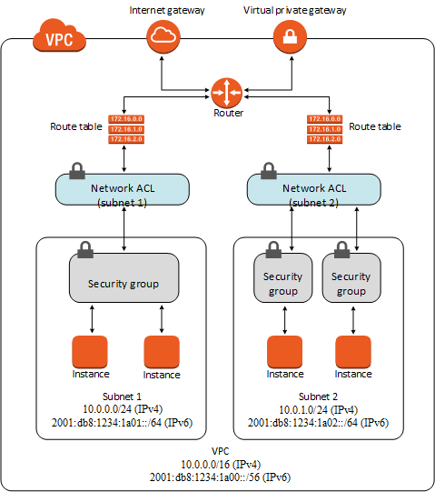

## Networking and VPC Architecture
- Include diagram
- Push to GitHub and share the repo link in chat at 10:30

### VPC
 - Amazon Virtual Private Cloud (VPC) lets you launch an isolated virtual network that you define. 
- You can decide IP address range, creation of subnets, the configuration of route tables and network gateways.
- Can create public-facing subnets with internet access, and back-end systems such as database or application servers with no internet access.
### Internet Gateway
- A horizontally scaled, highly available VPC component that allows communication between VPC and the internet.
- To enable internet access for a subnet, you need to attach an internet gateway to the VPC, add a route to the subnet's route table that directs internet-bound traffic to the gateway, ensure instances in the subnet have globally unique IP addresses, and ensure the network access control list and security groups allow relevant traffic to be sent/received by your instance.
### Routing table
- A route table contains a set of rules (routes) that determine where traffic from your subnet or gateway is directed.
- Main route table - automatically comes with VPC. Controls routing for all subnets not explicitly associated with any other table.
- You create custom route tables.
- Destination: The range of IP addresses where you want traffic to go.
- Target:The gateway, network interface or connection through which to sent destination traffic.
- Route table association between table and subnet and internet gateways.
- Subnets can be associated with a route table.
- Edge assocaition: a route table that allows you to route inbound VPC traffic to an appliance. You associate a table with the gateway, and specify the network interface as the target.

### What is a subnet
- A subnet is a range of IP addresses in a VPC. 
- You can attach resources such as EC2 instances to subnets.
- Can group instances together based on security and operational needs.
### What is a CIDR block
- When you create a VPC, you must specify the range of IPv4 addresses for the VPC in the form of a CIDR block.
- CIDR == Classless Inter-Domain Routing
### Sub-mask
- 
### IP-networking
- 
### NACL
- Network Access Control List
- Acts as a firewall for incoming traffic in and out of sunet/s.
- Similar to a security group in some ways, but has many differences.
