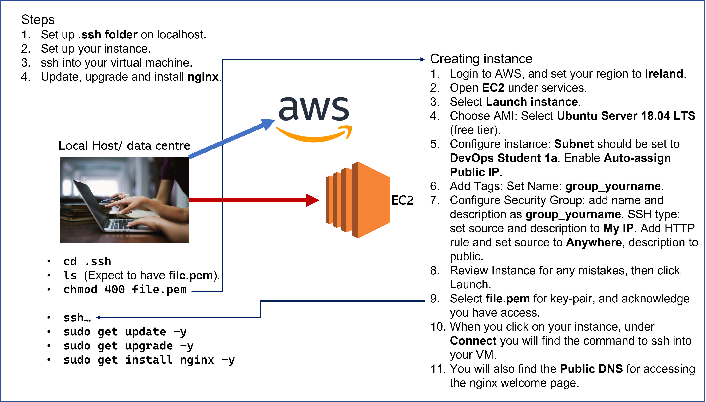
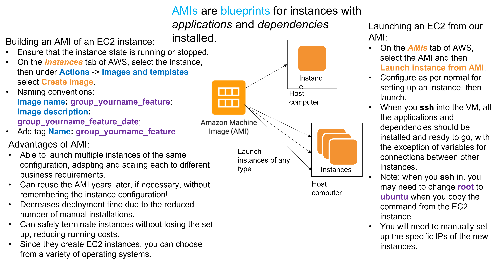

#Documentation

## Launching new instance on AWS using EC2:

### Starting Up:
- file.pem - move to .ssh folder in your machine.
Run `chmod 400 file.pem` to ensure the key is not publically viewable.
- IMPORTANT: Do NOT share this key with anyone - make sure it can't be accidentally uploaded to a public space, e.g., GitHub.
- Login to AWS
- Make sure region is set to Ireland.
- Open services menu and select EC2.
- Select Launch instance.
### Choose AMI
- Select `Ubuntu Server 18.04 LTS` from free tier options (can filter by `Free tier only`).
### Choose Instance Type
- System type should default to `t2 micro` for instance type.
### Configure Instance
- Make sure network is set to default, ending with `da`.
- Subnet should be set to DevOps student 1a.
- Enable `Auto-assign Public IP`.
- Tenancy - should default to Shared - Run a shared hardware instance.
### Add storage
- Should default to 8 GiB, General Purpose SSD (gp2).
### Add Tags
- Set your tag as Key: `Name`, Value: `group_yourname`.
- Note: Any untagged instances will be terminated.
### Configure Security Group
- Basic naming convention is to call your security group name and description the same as your tag - i.e., `group_yourname_sg`.
- For standard SSH type, set Source to `My IP`, and add to `my ip` to Description. Make sure Port Range is 22.
- `Add Rule`: set type to `HTTP` and set Source to `Anywhere`, and add `public` to Description. Port range should default to 80.
### Review and Launch
- You can review your Instance Launch for any mistakes, and then click `Launch`.
- You then need to select the existing key pair as file.pem, and acknowledge that you have access to the file.
- You can then view and edit your instance.

## Using AWS instance
### ssh into virtual machine
- When you click on your instance, navigate to `Connect`.
- Copy and run the command for connecting to your instance under 'Example'. You will need to enter `yes` when prompted.

### Installing nginx
- Run `sudo apt update -y`, `sudo apt upgrade -y`.
- Run 'sudo apt install nginx -y`.
- To check this, return to Connect page for your instance, and copy the Public DNS (see '4. Connect to your instance under Public DNS'). You should see the nginx welcome page. This is available to anyone with the Public DNS.

## AMIs (Amazon Machine Images)

An AMI is a blueprint for setting up an EC2 instance, with dependencies and applications installed.

### Building AMI

- Ensure the instance you want to create a blueprint for is running or stopped.
- Under Actions, Images and Templates select `Create Image`.
- Use the naming conventions in the above diagram.

### Launching an EC2 instance from your AMI

- On the AMIs tab of AWS, select the AMI and `Launch instance with AMI`.
- Configure as above for EC2 instance, and launch.
- Any applications and dependencies will be automatically configured, but any connections between instances using IPs will have to be set manually, as AWS reassigns new public IPs for each instance.
- Note: to `ssh` in the instance, you may need to change `root` to `ubuntu` when you copy the ssh command from 'Connect' page for the instance.

### Advantages of AMIs
- Can launch multiple instances with the same configuration and set up, adapting and scaling to meet business requirements.
- Can reuse blueprints years later without memorising the set up details.
- Decreases deployment time due to the reduced manual installations.
- Can safely terminate instances without losing the set-up, reducing running costs.
- Can choose from a variety of operating systems.