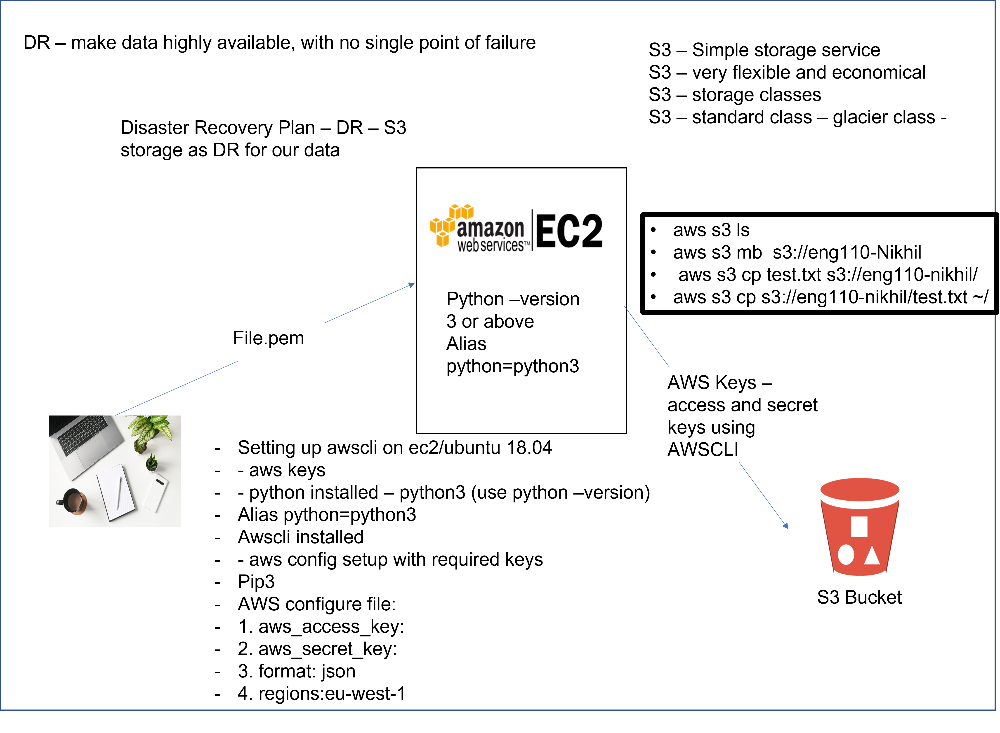

## S3 Bucket

### Managing buckets using Python (needs updating)
- Ensure Python3 and pip are installed.
- Install boto3 using pip - you may need to run: `python3 -m pip install boto3`
- Open python in linux
- Run commands from `s3_python_commands`